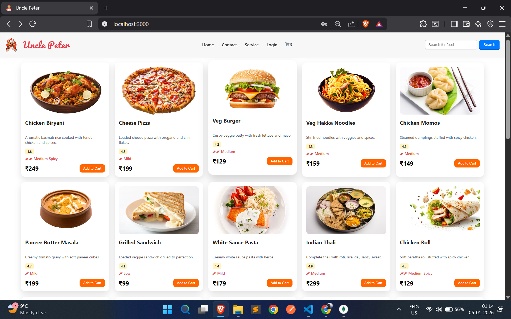
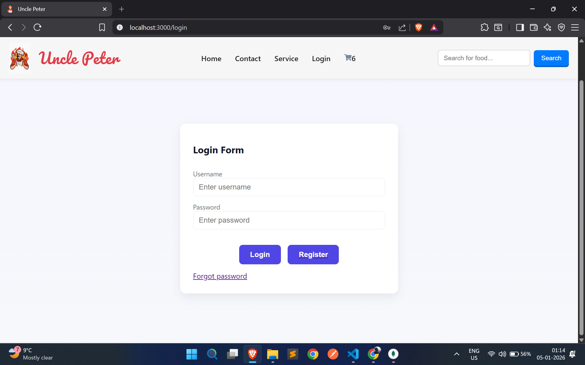
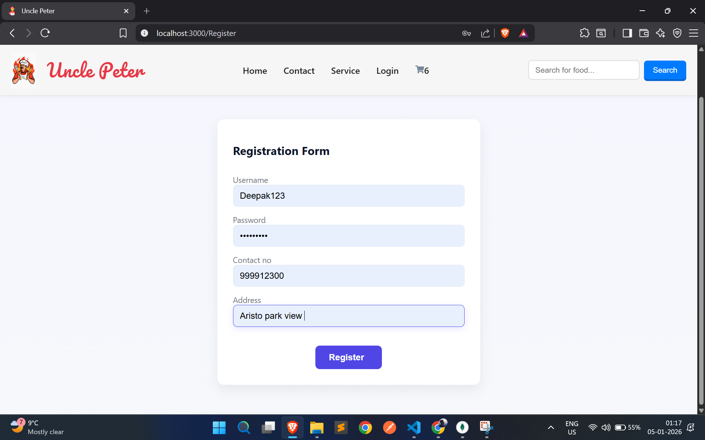
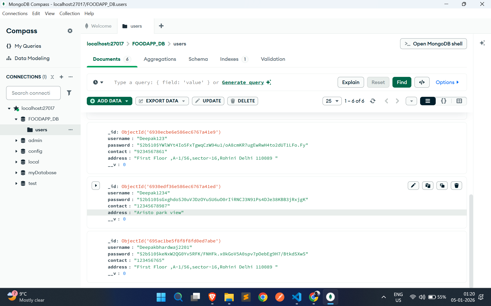

# 🍔 Food Delivery App — MERN Stack 🚀


A **full-stack MERN Food Delivery Application** built for real-world use, featuring **secure authentication (Login & Register)**, modern UI, REST APIs, and MongoDB database integration.

---

## 🌟 Highlights

✨ Built with **MERN Stack**  
🔐 Secure User Authentication (Login / Register)  
📱 Responsive & Modern UI  
⚡ RESTful API Architecture  
🗄️ MongoDB Database  
🚀 Portfolio-ready project  

---

## 🛠️ Tech Stack (MERN)

### ⚛️ Frontend
- React
- HTML5, CSS3, JavaScript
- Responsive UI

### 🟢 Backend
- Node.js
- Express.js
- REST APIs

### 🍃 Database
- MongoDB
- Mongoose

---

## 🔐 Authentication Flow

- 📝 User Registration
- 🔑 User Login
- 🔒 Encrypted Passwords
- 🧠 Session / JWT based flow

---

## 📸 UI Preview

### 🏠 Home Page


### 🔑 Login Page


### 📝 Register Page


### 🗄️ Data Base (MongoDB)


## 🎥 Demo Video

<video width="850" controls>
  <source src="Screen-Recording.mp4" type="video/mp4">
  Your browser does not support the video tag.
</video>

📌 *Add demo video inside a `demo/` folder*

---

## ⚙️ Installation & Setup

### 1️⃣ Clone the Repository
```bash
git clone https://github.com/iamdeepak199/Food-Delivery-App.git
cd Food-Delivery-App
2️⃣ Backend Setup
bash
Copy code
npm install
npm start
3️⃣ Frontend Setup
bash
Copy code
cd client
npm install
npm start
4️⃣ Environment Variables
Create a .env file in root directory:

env
Copy code
PORT=5000
MONGO_URI=your_mongodb_connection_string
🌐 Application URLs
Frontend → http://localhost:3000

Backend → http://localhost:5000

📁 Project Structure
bash
Copy code
Food-Delivery-App/
│
├── client/        # React Frontend
├── server/        # Node & Express Backend
├── models/        # MongoDB Models
├── routes/        # API Routes
├── screenshots/   # UI Screenshots
├── demo/          # Demo Video
└── README.md
🚀 Future Enhancements
🛒 Cart & Checkout

💳 Payment Gateway

📦 Order Tracking

👨‍💼 Admin Dashboard

⭐ Ratings & Reviews

🤝 Contributing
Contributions are welcome!
Fork the repo and submit a pull request.

📄 License
This project is licensed under the MIT License.

👤 Author
Deepak Bhardwaj
🔗 GitHub: https://github.com/iamdeepak199

⭐ If you like this project, don’t forget to star the repository!

yaml
Copy code

---

# 🔹 SHORT VERSION (For Resume / Quick View)

```md
# Food Delivery App (MERN Stack)

A full-stack **MERN Food Delivery Application** with **React frontend**, **Node & Express backend**, **MongoDB database**, and **secure Login & Registration system**.

**Tech:** React | Node.js | Express | MongoDB  
**Features:** Auth, REST APIs, Responsive UI  

🔗 GitHub: https://github.com/iamdeepak199/Food-Delivery-App
